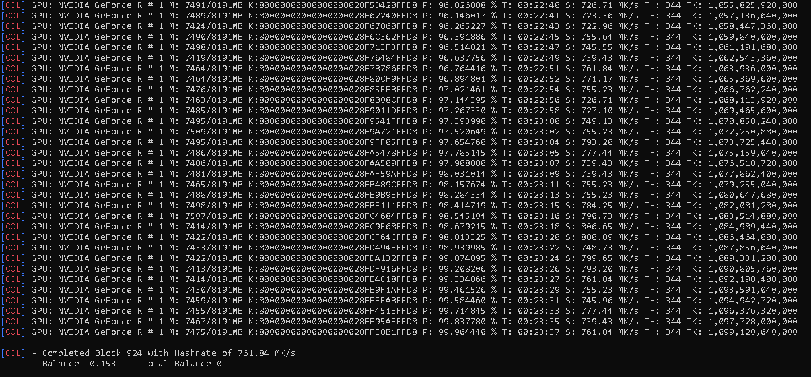
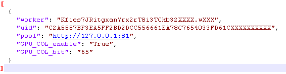

# Keyminer

Used in brute-forcing Bitcoin private keys. The main purpose of this project is to contribute to the effort of solving the Bitcoin puzzle transaction: A transaction with 32 addresses that become increasingly difficult to crack.

### Rewards

There are two ways to receive mining rewards using this system. 

**1.** You will be paid 0.000492	 KEY for each block which is based on the listed price KEY with XeggeX.com. 

**2.** If a puzzle is solved then the total balance minded will sent up to the amount found.  

### Settings

Depending on the type of NVIDIA card you may need to adjust these swiches based on the memory capacity. These settings work well with the RTX 3060TI GPU.  

keyminer-cli.exe --blocks=64 --points=2500 --threads=256

### Config

The pool address will be provided soon since we are still testing. ` GPU_COL_ENABLE `  should equal true and `GPU_COL_bit` should equal the puzzle you would like to work on. See the puzzle list [Bitcoin Puzzles](puzzles/README.md).

### Dependencies
 
.NET: Dotnet Core 6.0
For CUDA: CUDA Toolkit 10.1

### Supporting this project
If you find this project useful and would like to support it, consider making a donation. Your support is greatly appreciated!

<b>KEY:</b>  KcKhd2xtLcQ9hwkxa4WCBATjLgSyXfPZDL
